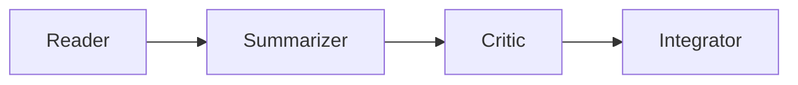
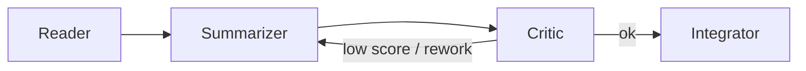

# Multi Agent Paper Analyzer

Wir orchestrieren denselben Workflow mit drei Frameworks:
- **LangChain**: Sequenziell (Reader → Summarizer → Critic → Integrator)
- **LangGraph**: Graph mit DOT Visualisierung für den Kontrollfluss
- **DSPy**: Deklarativ mit optionalem Teleprompting

---

## Projektübersicht (60 Sekunden)

### Agenten-Pipeline (konzeptionell)

**LangChain (linear)**


**LangGraph (Graph + Conditional Flow)**

Hinweis: Im Projekt enthält der LangGraph-Workflow zusätzlich Translator-/Keyword-/Quality-/Judge-/Aggregator-Nodes (siehe „LangGraph Highlights“ und `app/workflows/langgraph_pipeline.py`).

**DSPy (Signatures statt explizitem Prompt)**
- Statt pro Agent einen Prompt-String zu definieren, nutzt DSPy `dspy.Signature` (Inputs/Outputs + Constraints) und generiert Prompts daraus automatisch (`app/workflows/dspy_pipeline.py`).

### Framework-Unterschiede (warum 3 Paradigmen?)

| Framework | Paradigma | Vorteile | Nachteile | Beispiel im Projekt |
|---|---|---|---|---|
| LangChain | Sequenziell | Einfach, leicht nachvollziehbar | Kein Conditional Flow / Looping | `app/workflows/langchain_pipeline.py:run_pipeline()` |
| LangGraph | Graph-based | Flexibel, visualisierbar, Conditional Edges | Komplexer (State + Routing) | `app/workflows/langgraph_pipeline.py:_build_langgraph_workflow()` |
| DSPy | Deklarativ / Self-Improving | Automatische Prompt-Optimierung (Teleprompting), klare Signatures | Braucht Dev-Set, kann langsamer sein | `app/workflows/dspy_pipeline.py` (`dspy.Signature`, `run_pipeline()`) |

### Mini-Beispielausgabe (Form der Ergebnisse)

| Framework | Ergebnis-Felder (Auszug) | Projekt-spezifische Extras |
|---|---|---|
| LangChain | `structured`, `summary`, `critic`, `meta`, `latency_s`, `reader_s`… | — |
| LangGraph | `structured`, `summary`, `critic`, `meta`, `latency_s`, `reader_s`… | `summary_translated`, `keywords`, `critic_loops`, `graph_dot` |
| DSPy | `structured`, `summary`, `critic`, `meta`, `latency_s`, `reader_s`… | `dspy_available` (+ optional Teleprompting) |

## Schnell starten
- **Windows:** Doppelklick auf `launchers/run.bat`
- **Mac/Linux:** Doppelklick auf `launchers/run.sh` (oder `chmod +x launchers/run.sh && ./launchers/run.sh`)

Das Startskript prüft Python, legt ein virtuelles Environment an, installiert die Abhängigkeiten und startet Streamlit. Wenn `.env` neu angelegt wird, kommt eine kurze Erinnerung zum API-Key.

Mehr Details zur Einrichtung stehen in `docs/participants/START_HIER.md`.

---

## Checkliste für den Schnellstart
1. Python 3.9+ prüfen:
   ```bash
   python --version
   ```
2. Virtual Environment einrichten:
   ```bash
   python -m venv venv
   source venv/bin/activate    # Windows: venv\Scripts\activate
   ```
3. Abhängigkeiten installieren:
   ```bash
   pip install -r requirements.txt
   ```
4. API-Key setzen (falls noch nicht vorhanden):
   ```bash
   cp .env.example .env
   # dann OPENAI_API_KEY=sk-... eintragen
   ```
5. App starten:
   ```bash
   python -m streamlit run app/app.py
   ```

---

## Nutzung
- Datei hochladen (PDF/TXT) → strukturierte Notizen + Kontext
- Pipeline wählen (LangChain, LangGraph, DSPy) und Einstellungen anpassen
- „Starten“ führt die gewählte Pipeline aus
- „Alle Pipelines vergleichen“ zeigt Outputs und Metriken nebeneinander
- DSPy Teleprompt Gain vergleicht DSPy mit und ohne Teleprompting (Dev-Set erforderlich)
- Im Expander „Telemetry (CSV)“ stehen Laufzeitdaten

---

## LangGraph Highlights
- Der LangGraph-Workflow beinhaltet jetzt explizite Translator-, Keyword- und Judge-Aggregator-Nodes, die ihr im Visual Tab und im Code seht.
- Conditional Edges entscheiden auf Basis der Critic-Score bzw. Summary-Länge, ob Quality übersprungen oder der Summarizer neu gestartet wird, wodurch der Graph flexibler wird.
- Ihr könnt die Translator-/Keyword-Logik oder die Schwellenwerte im Graph-Code verändern und sofort beobachten, wie sich die Visualisierung und der Workflow verändern.

---

## Details zu DSPy
- Checkbox „DSPy optimieren“ aktiviert Teleprompting mit `dev-set/dev.jsonl`
- Das Dev-Set enthält 15 kuratierte Fälle aus verschiedenen Fachrichtungen. Zu jedem Beispiel gehören `target_length` (short/medium/long) und `prompt_focus` (Results/Method/Conclusion), damit Teleprompting sichtbar macht, wie DSPy Prompts adaptive anpasst und der Qualitäts-/Latenz-Trade-off entsteht.
- Fehlen `dspy-ai`, `litellm` oder die API-Keys, läuft eine Stub-Variante mit Dummy-Output und einem Hinweistext in `meta`, damit das UI nicht abstürzt und Teilnehmer den Mechanismus trotzdem sehen können

---

## Evaluierung
- `app/eval_runner.py` wertet `dev-set/dev.jsonl` über alle Pipelines aus und berechnet ein einfaches unigram-F1

---

## Struktur
### Code
- `app/`: Anwendungscode
  - `app/app.py`: Streamlit-Frontend
  - `app/agents/`: Reader, Summarizer, Critic, Integrator
  - `app/workflows/`: Pipeline Definitionen
  - `app/eval_runner.py`: Dev Set Auswertung
  - `app/llm.py`: LLM Konfiguration
  - `app/telemetry.py`: Logging
  - `app/utils.py`: Text Vorverarbeitung
- `dev-set/`: Beispiel-Inputs für Teleprompting

### Dokumentation
- `docs/participants/`: Anleitungen für Teilnehmer
  - `START_HIER.md`
  - `TEILNEHMER_SKRIPT.md`
  - `CODE_EXPERIMENTE.md`
- `docs/moderators/`: Moderatorenunterlagen
- `project_overview.md`: Hintergrund & Design

### Startskripte
- `launchers/run.bat`: Windows Startskript
- `launchers/run.sh`: Mac/Linux Startskript

---

## Workshop Informationen
- Start: `docs/participants/START_HIER.md`
- Aufgaben & Experimente: `docs/participants/TEILNEHMER_SKRIPT.md`
